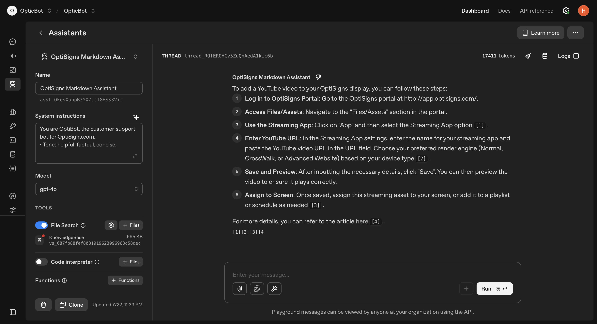

# OptiBot – Zendesk Article Scraper & OpenAI Vector Store Uploader

**OptiBot** is a customer support bot for [OptiSigns.com](https://www.optisigns.com) that automates the following:

- Scrapes articles from Zendesk Help Center (support.optisigns.com)  
- Converts them to Markdown  
- Uploads them to OpenAI Vector Store  
- Enables semantic retrieval for Assistant API  

---

## Setup

### 1. Clone the Repository & Setup

```bash
git clone https://github.com/your-username/optibot.git
cd optibot
```

### 2. Install Python Dependencies

(Optional) Create a virtual environment:

```bash
python -m venv venv
source venv/bin/activate
```

Install requirements:

```bash
pip install -r requirements.txt
```

---

## Run Locally

### 1. Key Components

| File                  | Description                                       |
|-----------------------|---------------------------------------------------|
| `scrape.py`           | Scrapes Zendesk articles and converts to Markdown |
| `bot.py`              | Create assistant                                  |
| `main.py`             | Orchestrates scraping, checks for changes, uploads to OpenAI Vector Store |

### 2. Run Manually

```bash
python main.py
```

---

## Docker & Deployment

### 1. Build and Push Docker Image

```bash
docker build -t hh68201/optibot .
docker tag hh68201/optibot hh68201/optibot:latest
docker push hh68201/optibot
```

### 2. Schedule Cron Job on DigitalOcean Droplet

**Create `/root/optibot/run.sh`:**
```bash
#!/bin/bash
cd /root/optibot
docker pull hh68201/optibot
docker run --rm hh68201/optibot >> /root/optibot/cron.log 2>&1
```

**Set Cron Job (Run at 7:00 AM UTC daily):**
```bash
crontab -e
```
Then add:
```cron
0 7 * * * /bin/bash /root/optibot/run.sh >> /root/optibot/cron.log 2>&1
```

---

## Daily Job Logs

Logs are saved at:

```bash
/root/optibot/cron.log
```

Check job execution logs:

```bash
cat /root/optibot/cron.log
```

Check last run time:

```bash
grep CRON /var/log/syslog | tail
```

---

## Screenshot: Assistant Playground



